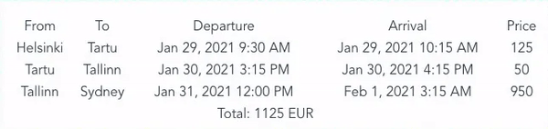

# WAD 2020 Resit Exam: Project A

## Project setup
```
npm install
```

### Compiles and hot-reloads for development
```
npm run serve
```

# Setup

You will need to [import](https://docs.github.com/en/free-pro-team@latest/github/importing-your-projects-to-github/importing-a-repository-with-github-importer) 
this repository to you GitHub account, to do that please follow these steps:
* Go to Github [import page](https://github.com/new/import)
  * **Note**: you have to be logged in to your GitHub account
* In the first field `"Your old repository’s clone URL"` enter URL of this repository `https://github.com/tsotnekekelia/wad20-exam3-a`
* In  the next field give it a name
* Make it **Private**
* And begin to import, it should take few seconds
* Add me as a collaborator to your new repository, [click here](https://docs.github.com/en/free-pro-team@latest/github/setting-up-and-managing-your-github-user-account/inviting-collaborators-to-a-personal-repository)
 to learn how
  * My `email` and `username` on github is: `cotne.kekelia@yahoo.com` and `tsotnekekelia`


# Tasks

Modify [FlightList.vue](src/components/FlightList.vue)
 so that it displays all the flight objects that are passed to it from [App.vue](./src/App.vue)

1. Display from, to, departure, arrival and price of each flight _**[5 points]**_
2. Have a **computed property** called `sortedFlights` 
that sorts received list by departure (earliest to latest by default) _**[6 points]**_
3. Have a **computed property** called `total` that calculates 
total price of all flights and display it in the `span`
 element that has the **id** `total` _**[6 points]**_
4. On click on the Departure label (element with id `departure-label`) 
toggle order of the list by departure time, from latest to earliest and vice versa _**[5 points]**_
5. have a filter `timeFormat` that formats departure and arrival times into this format `Jan 30, 2021 3:15 PM`,
 Note: to make it easy, use `moment.js` library which is already installed.  _**[3 points]**_

Your app should look something like this:


